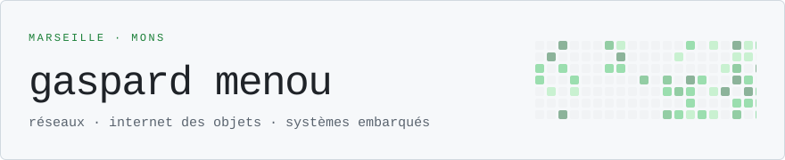
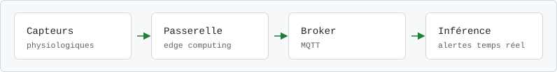

<picture>
  <source media="(prefers-color-scheme: dark)" srcset="assets/banner-dark.svg">
  
</picture>

```
$ whoami
étudiant ingénieur à Centrale Méditerranée — je conçois des systèmes
qui mesurent le monde physique et le mettent en réseau.
```

## ~/rami

 &nbsp;Laboratoire [ILIA](https://web.umons.ac.be/ilia/en/home/) · Université de Mons, Belgique

**RAMi** — *Real-time Architecture for Monitoring*. J'ai développé une architecture IoT médicale pour le suivi en temps réel de patients âgés : de l'acquisition capteur jusqu'à l'inférence, en passant par le traitement en périphérie et un transport MQTT.

<picture>
  <source media="(prefers-color-scheme: dark)" srcset="assets/rami-dark.svg">
  
</picture>

## ~/stack

| domaine | outils &amp; technologies |
| :--- | :--- |
| réseaux &amp; IoT | `MQTT` `ESP32` `Arduino` `edge computing` |
| programmation | `Python` `C` `MATLAB` |
| outillage | `Git` `Linux` `Docker` `LaTeX` |
| immersif &amp; fabrication | `VR / AR` `impression 3D` `découpe laser` |

## ~/associations

Je m'investis dans plusieurs associations étudiantes de [Centrale Méditerranée](https://www.centrale-med.fr/), où je mêle technique, gestion de projet et communication.

| association | rôle | ce que j'y fais |
| :--- | :--- | :--- |
| [**FabLab Marseille**](https://fablab.asso.centrale-marseille.fr/) | `vice-président` | J'encadre les projets étudiants en fabrication numérique et je coordonne les activités du laboratoire. |
| [**E-Gab**](https://www.instagram.com/e_gab_ecm/) | `responsable fablab` | J'accompagne les membres dans la conception et la réalisation de leurs prototypes. |
| [**EC'lairage**](https://eclairage.asso.centrale-med.fr/) | `responsable com` | Je gère la communication de l'association de régie son et lumière, et la mise en place technique d'événements étudiants. |

## ~/repères

<picture>
  <source media="(prefers-color-scheme: dark)" srcset="https://github-profile-summary-cards.vercel.app/api/cards/stats?username=GaspardMenou&theme=github_dark">
  
</picture>
<picture>
  <source media="(prefers-color-scheme: dark)" srcset="https://github-profile-summary-cards.vercel.app/api/cards/productive-time?username=GaspardMenou&theme=github_dark&utcOffset=2">
  
</picture>

## ~/liens

[gaspardm.fr](https://gaspardm.fr/) &nbsp;·&nbsp; [LinkedIn](https://www.linkedin.com/in/gaspard-menou-100421331/) &nbsp;·&nbsp; [gaspard.menou@centrale-med.fr](mailto:gaspard.menou@centrale-med.fr)

---

<sub>marseille · mmxxvi</sub> 
